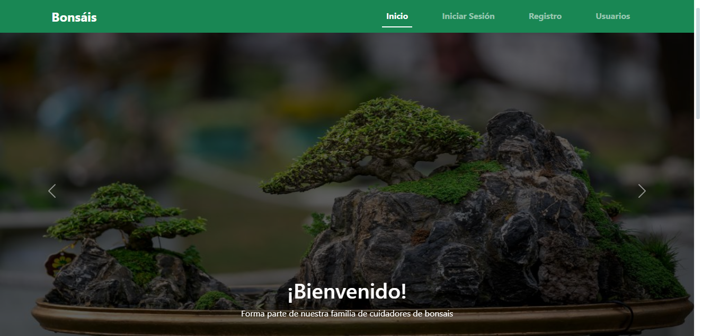

# Bonsáis
Una pagina web desarrollada por Yesid Borrero y Hammer Camo como proyecto de tarea para la nota correspondiente al 10% de la nota del corte con el objetivo de afianzar los conocimientos adquiridos durante la introducción a Bootstrap realizada en clase remota y tambien de otras fuentes como la documentación misma de dicha biblioteca.
La página web tiene como contexto la enseñanza sobre los bonsáis y su cuidado, asi como tambien el servicio de compra y venta que permite el intercambio entre usuarios, también dispone de una tabla donde se aprecia a cada uno de los usuarios ya registrados y la información del progreso de estos en la pagina.

